# GymHub

Sistema de gestão para academias — controle de alunos, mensalidades, treinos e equipe, com painéis diferentes por cargo (proprietário, recepção, professor, aluno).

## Telas

| Login |
|---|
| 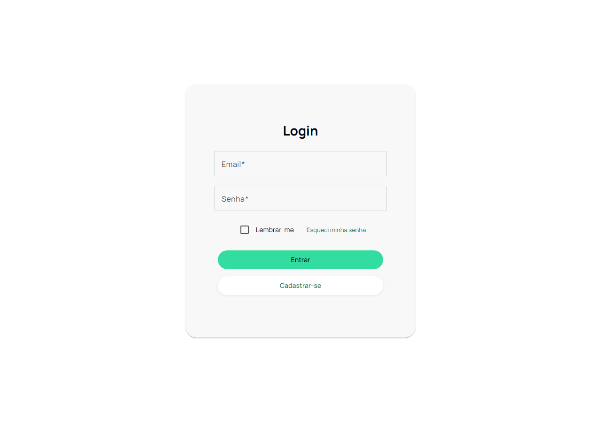 |

### Proprietário

| Dashboard | Alunos | Funcionários |
|---|---|---|
| 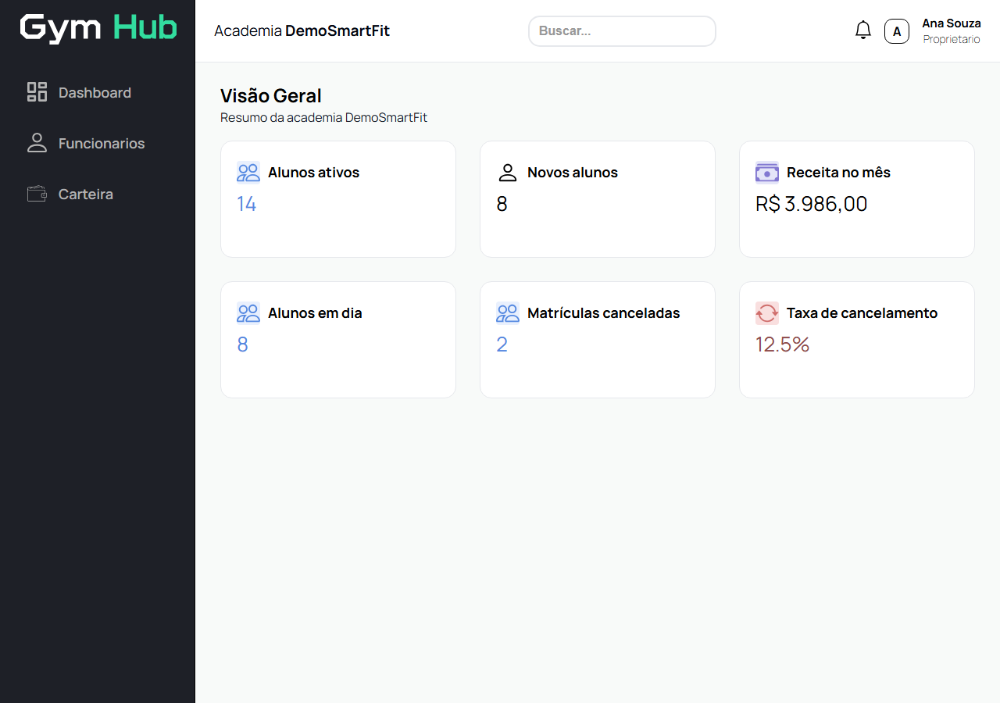 | 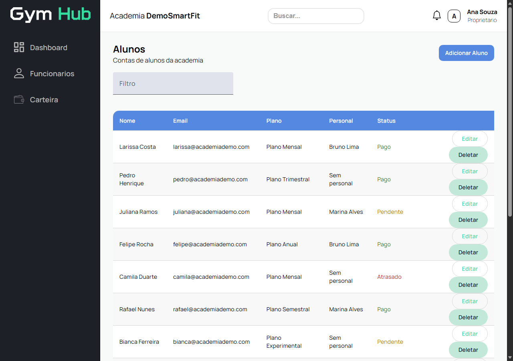 | 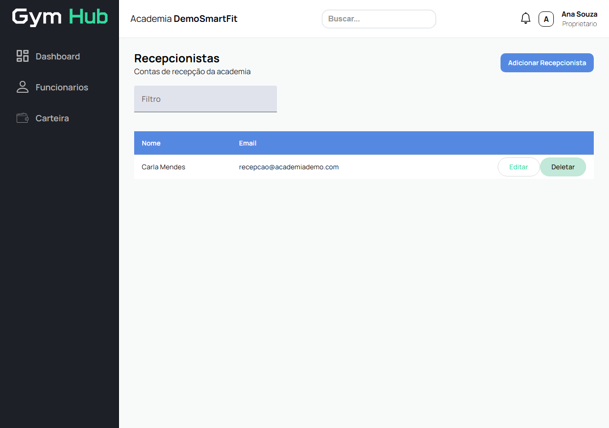 |

| Carteira | Configurações |
|---|---|
| 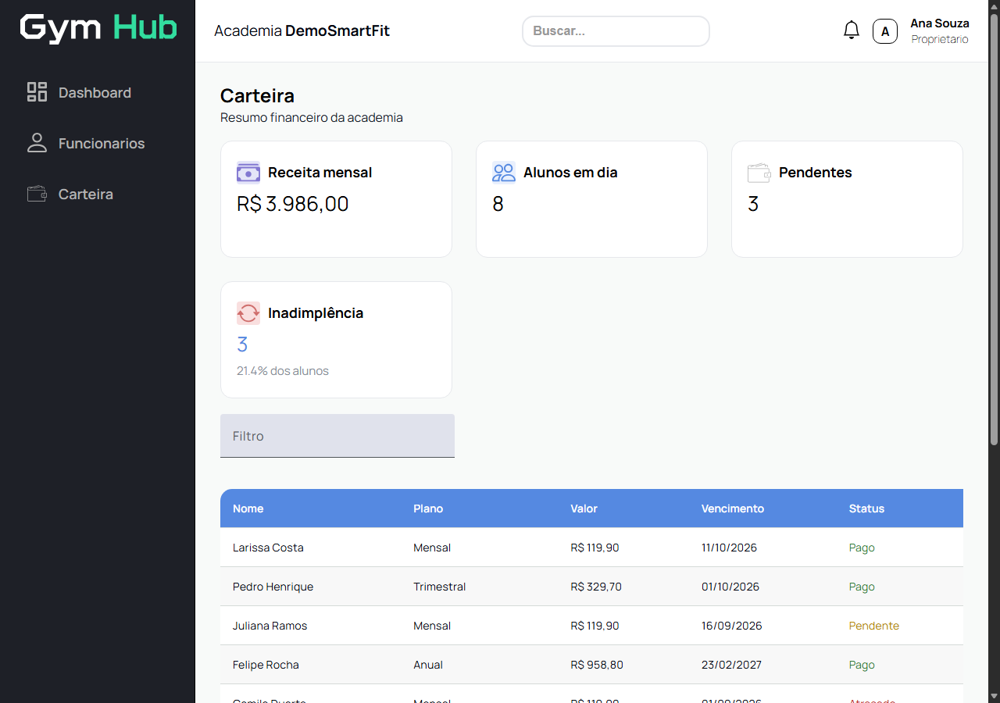 | 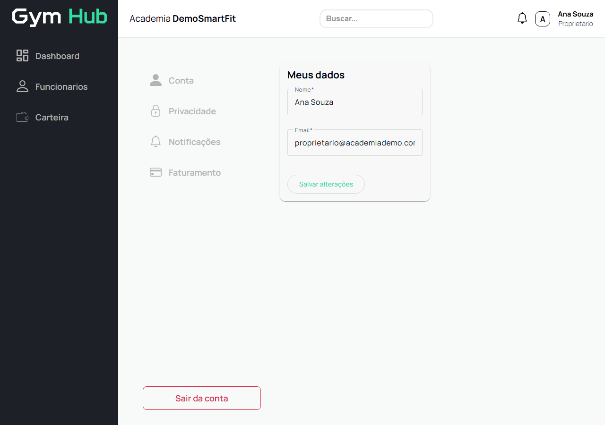 |

### Recepção

| Dashboard | Professores e Personais | Mensalidades |
|---|---|---|
| 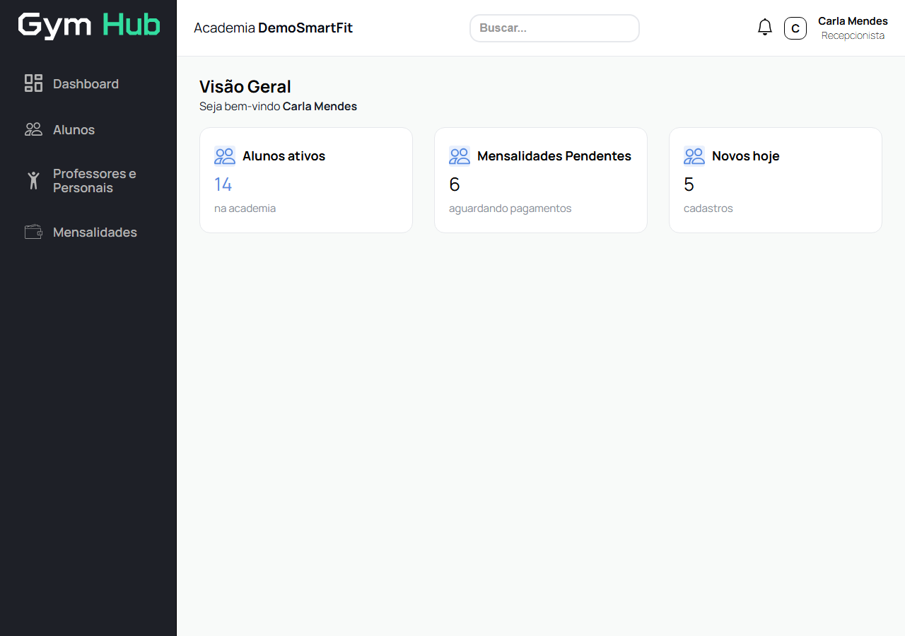 | 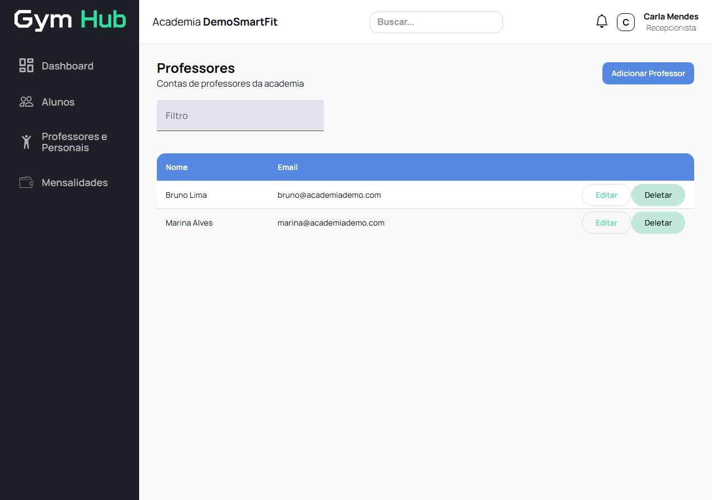 | 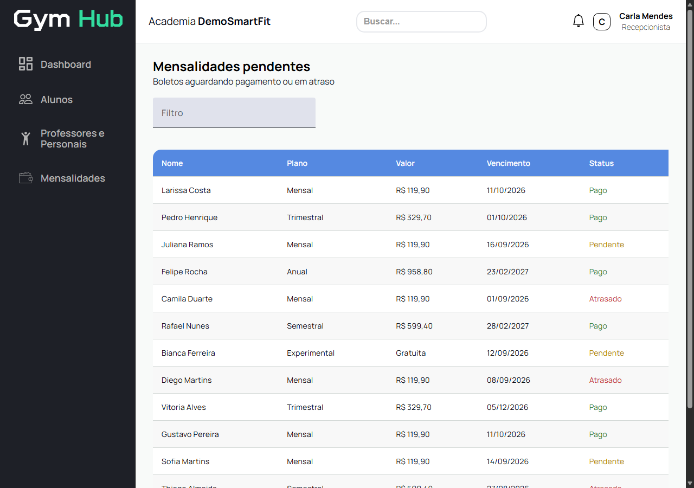 |

### Professor

| Alunos |
|---|
| 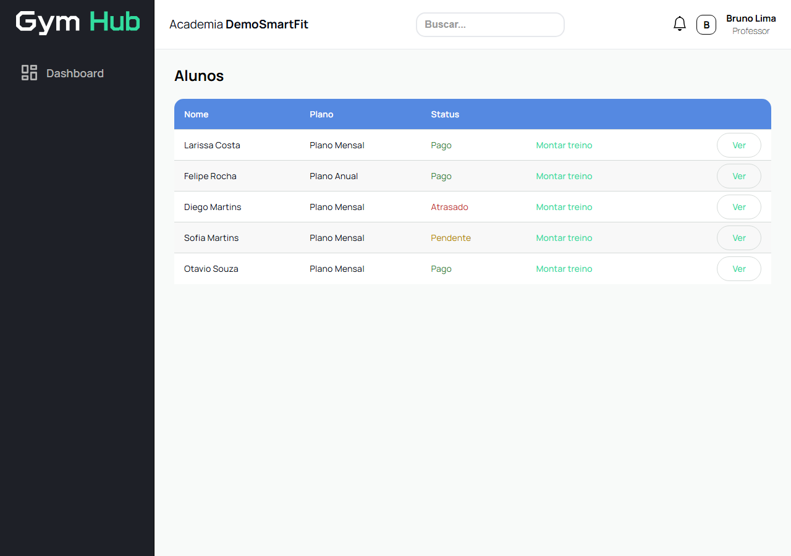 |

### Aluno

| Dashboard | Treino | Meu plano |
|---|---|---|
| 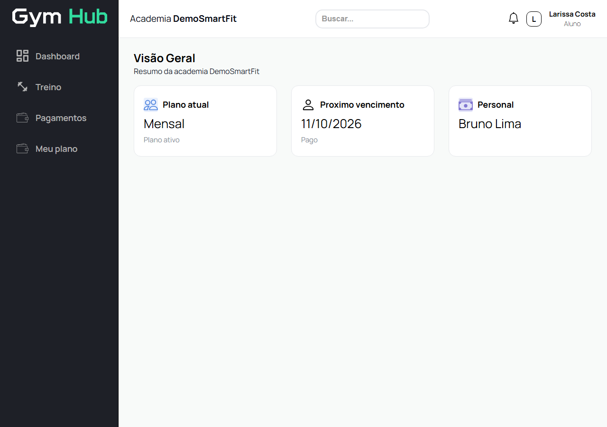 | 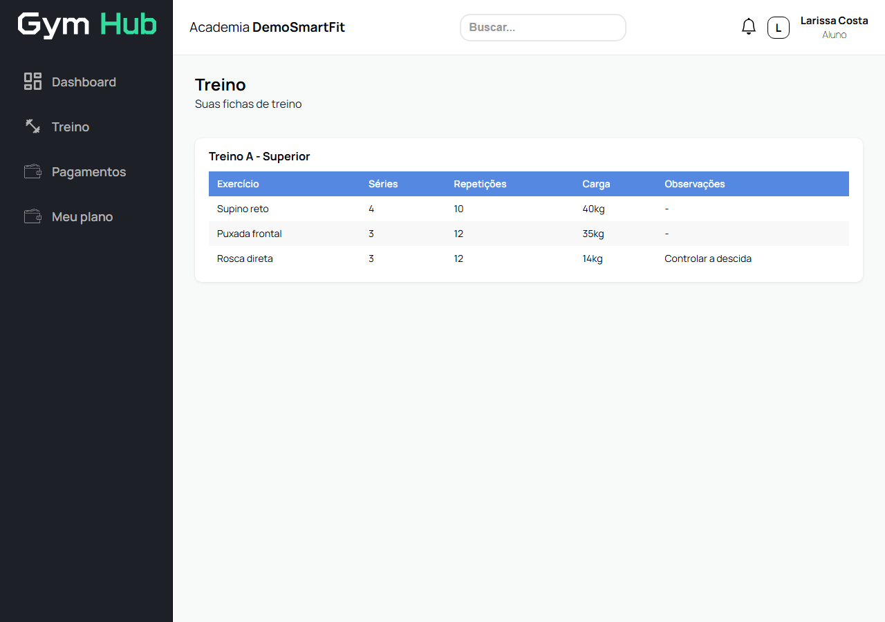 | 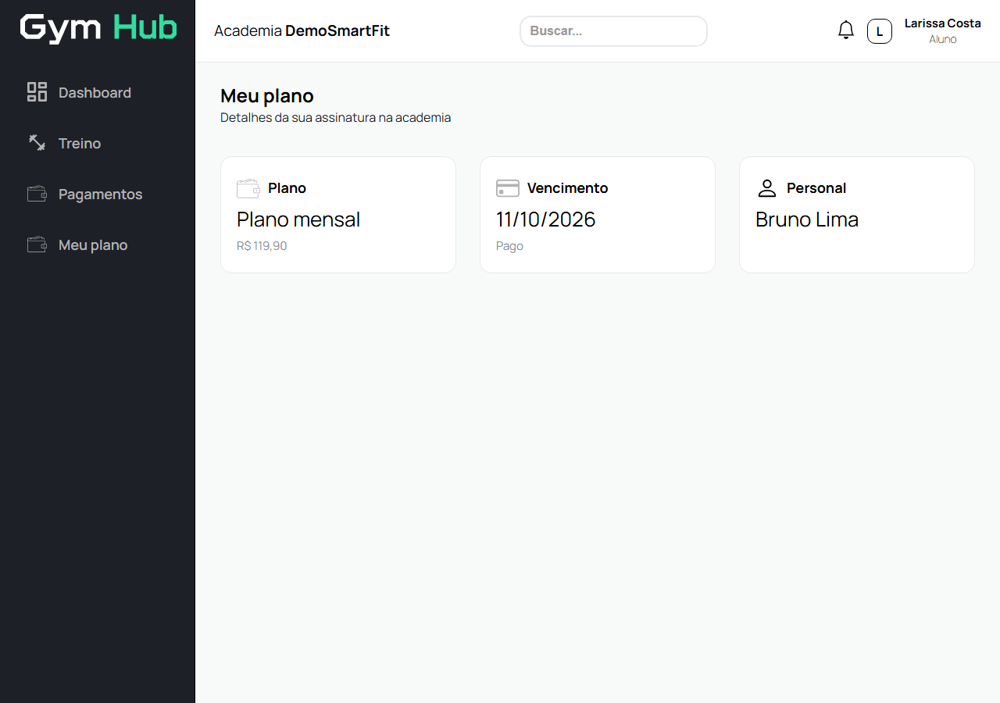 |

## Funcionalidades

- **Login por cargo** — proprietário, recepcionista, professor e aluno, cada um com seu próprio painel e permissões.
- **Dashboard** — alunos ativos, novos alunos, receita no mês, matrículas canceladas, taxa de cancelamento.
- **Alunos** — cadastro, edição, planos (experimental, mensal, trimestral, semestral, anual), personal trainer vinculado e status de pagamento (pago/pendente/atrasado).
- **Funcionários e professores** — gestão de equipe.
- **Mensalidades e carteira** — controle financeiro da academia.
- **Fichas de treino** — exercícios com séries, repetições e carga, vinculados a aluno e professor.
- **Configurações** — conta, privacidade, notificações e faturamento.
- **Responsivo** — layout adaptado para desktop, tablet e mobile.

## Login de demonstração

Na primeira execução (localStorage vazio) o app gera dados fake de uma academia fictícia. Senha `123456` para todos:

| Cargo | Email |
|---|---|
| Proprietário | proprietario@academiademo.com |
| Recepção | recepcao@academiademo.com |
| Professor | bruno@academiademo.com |
| Aluno | larissa@academiademo.com |

## Stack

- Angular 21 (standalone components, `@if`/`@for`)
- Angular Material + CDK
- RxJS
- Vitest (testes unitários)

## Scripts

```bash
ng serve   # dev server
ng build   # build de produção
ng test    # testes unitários (Vitest)
```
